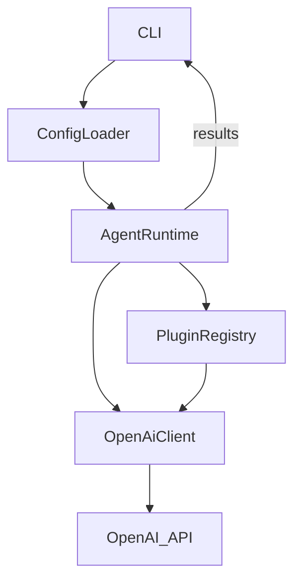

# Design Specification for OpenAI Agents (Rust)

## 1. High‑Level System Overview

The OpenAI Agents project provides a **library crate** that can be embedded in other Rust applications **and** a **CLI** for direct interaction. It orchestrates **agents**, loads **plugins**, manages **configuration**, and communicates with the OpenAI API via an async HTTP client. The system is built around async primitives, is `Send + Sync` safe, and is extensible through a dynamic plugin interface.

## 2. Module & File Layout

```text
src/
├── lib.rs                # Public crate entry point, re‑exports
├── cli.rs                # CLI implementation (uses clap)
├── agent/
│   ├── mod.rs            # Agent orchestration
│   ├── runtime.rs        # Runtime structs & async execution
│   └── traits.rs         # Core agent traits
├── plugin/
│   ├── mod.rs            # Plugin manager
│   ├── loader.rs         # Dynamic loading (libloading)
│   └── traits.rs         # Plugin trait definition
├── config/
│   ├── mod.rs            # Configuration loader
│   └── schema.rs         # Config structs (serde)
├── client/
│   ├── mod.rs            # OpenAI client wrapper
│   └── request.rs        # Request/response types
├── utils/
│   ├── mod.rs            # Misc utilities
│   └── logger.rs         # Logging helper
└── error.rs              # Central error type (thiserror)
```

## 3. Core Types (Structs, Traits, Functions)

### 3.1 Agent Module

- `pub trait Agent: Send + Sync { async fn run(&self, ctx: &AgentContext) -> Result<()>; }`
- `pub struct AgentContext { pub config: Arc<Config>, pub client: Arc<OpenAiClient>, pub plugins: Arc<PluginRegistry>, }`
- `pub struct AgentRuntime { pub agents: Vec<Arc<dyn Agent>>, }`
- `impl AgentRuntime { pub async fn start(&self) -> Result<()>; }`

### 3.2 Plugin Module

- `pub trait Plugin: Send + Sync { fn name(&self) -> &str; fn init(&self, ctx: &PluginContext) -> Result<()>; }`
- `pub struct PluginContext { pub config: Arc<Config>, pub client: Arc<OpenAiClient>, }`
- `pub struct PluginRegistry { pub plugins: HashMap<String, Arc<dyn Plugin>>, }`
- `impl PluginRegistry { pub fn load_from_dir(path: &Path) -> Result<Self>; pub fn get(&self, name: &str) -> Option<Arc<dyn Plugin>>; }`

### 3.3 Config Module

- `#[derive(Debug, Deserialize, Serialize, Clone)] pub struct Config { pub api_key: String, pub model: String, pub log_level: String, #[serde(default)] pub plugins_path: PathBuf, // … }`
- `pub fn load() -> Result<Config>; // reads from $HOME/.config/openai_agents.yaml or env vars`

### 3.4 Client Module

- `pub struct OpenAiClient { pub http: reqwest::Client, pub config: Config, }`
- `impl OpenAiClient { pub async fn chat_completion(&self, req: ChatRequest) -> Result<ChatResponse>; }`

## 4. Configuration Schema

```yaml
api_key: "<YOUR_OPENAI_API_KEY>"
model: "OPENAI_AGENTS__MODEL"
log_level: "info"
plugins_path: "~/.config/openai_agents/plugins"
# optional overrides
max_concurrent_requests: 5
```

Environment variables can override any key using the `OPENAI_AGENTS_<UPPERCASE_KEY>` pattern (e.g., `OPENAI_AGENTS_API_KEY`).

## 5. Dependency List (Cargo.toml)

```toml
to be updated with the current values
```

## 6. Data Flow Diagram



## 7. Extensibility & Plugin Architecture

- Plugins are compiled as dynamic libraries (`.so` / `.dylib`) exposing a `#[no_mangle] pub extern "C" fn register(reg: &mut PluginRegistry)` entry point.
- The `Plugin` trait defines optional hooks (`init`, `on_message`, `on_error`). New plugins can be added without recompiling the core crate.
- Version compatibility is enforced via a `PLUGIN_API_VERSION: u32` constant; the core checks this at load time.
- Plugins are discovered by scanning the directory defined in `Config::plugins_path`.

## 8. Logging & Error Handling

- Central error type `Error` defined in `error.rs` using `thiserror::Error`.
- Logging initialized from `log_level` config via `env_logger::Builder`.

## 9. Testing Strategy

- Unit tests for each module under `src/**/*.rs` using `#[cfg(test)]`.
- Integration tests in `tests/` exercising the full CLI flow with a local vLLM OpenAI Compatible server

## 10. Build & Release

- Library published on crates.io with `cargo publish`.
- CLI binary built with `cargo build --release`.
- CI pipeline (GitHub Actions) runs `cargo fmt`, `cargo clippy`, `cargo test`, and creates a release artifact.

*This document is intended for developers and contributors to understand the architecture, extend the system, and maintain consistency across releases.*
